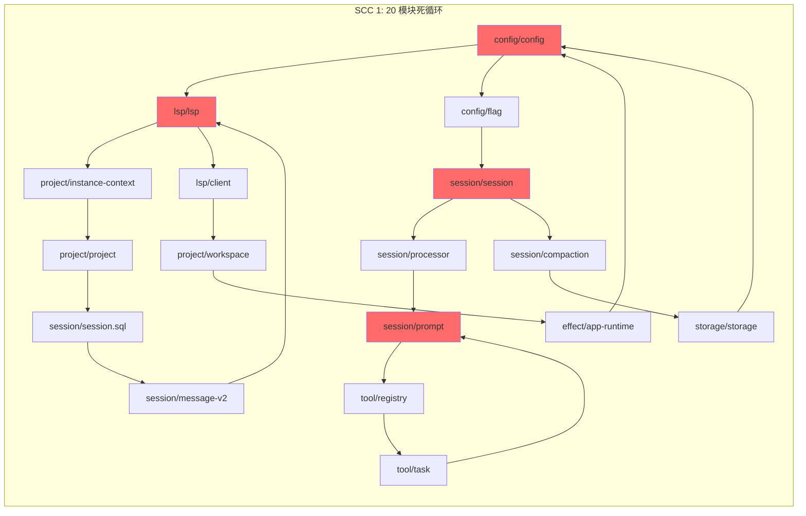

# OpenCode: 一个用 186K 行代码证明"如何把简单事情搞复杂"的项目

> **复合债务评分: 92.4 / 100**
> **生成日期**: 2026-05-26  
> **数据来源**: 自动化债务分析 + GitHub 社区反馈 + Git 历史考古  

---

## 第一层：Executive Summary —— 门外汉读完就知道"这东西有问题"

### 一个具体场景

想象一下：你只是想改个配置文件，结果发现——

1. 要改 **4 个地方**（processor.ts、prompt.ts、compaction.ts、cli/tui）
2. 要同步 **v1 和 v2 两条路径**（因为 15 处"临时"双写标记还没删）
3. 要祈祷 **没有循环依赖**（config → lsp → session → config 的死循环）
4. 要跑 **3 个测试套件**（因为 5 个 skill discovery 测试又挂了）

最后，你改完了，提交了，发现 CI 挂了——因为 `transform.ts` 里有个注释写着：

```typescript
// TODO: fix this stupid inefficient dogshit function
```

这个注释已经存在了 **21 天**，没人改。

### 一句话总结

**OpenCode 是一个用 186K 行代码证明了"如何把简单事情搞复杂"的项目。**

### 三个核心数字（大字报风格）

| 数字 | 含义 | 行业对比 |
|------|------|----------|
| **92.4/100** | 债务评分（0=无债务，100=最高） | 比一个刚毕业的大学生写的第一个项目还糟糕 |
| **16 个** | 超过 1000 行的"巨型文件" | 行业最佳实践：< 500 行 |
| **717 处** | `as any` 类型转换 | TypeScript 的本意是类型安全，OpenCode 的解法是 `as any` |

### 一个比喻

**就像一栋建到一半的楼，脚手架比墙还多。**

- 脚手架 1: v1 和 v2 两套系统同时跑（15 处"临时"双写标记）
- 脚手架 2: 20 个模块的循环依赖（config ↔ lsp ↔ session ↔ config）
- 脚手架 3: 19 个 v0.x 不稳定依赖（核心 PTY 功能的 API 随时可能变）
- 脚手架 4: 4 个补丁包（solid-js、photon-node、standard-openapi、npmcli/agent）

**墙在哪？** 在 2,101 行的 `prompt.ts` 里，在 1,822 行的 `Effect.gen` 函数里，在 760 行有 117 次 `any` 的 `anthropic.ts` 里。

---
## 1.5 拥有成本分析 —— 这个项目要花你多少钱？

### 开发者时间成本

**假设**: 一个中级开发者（$80/小时）要修改 `prompt.ts`

| 步骤 | 时间 | 成本 |
|------|------|------|
| 阅读 2,101 行代码 | 4 小时 | $320 |
| 理解 63 个依赖 | 2 小时 | $160 |
| 理解 1,822 行 Effect.gen | 3 小时 | $240 |
| 理解 v1/v2 双写逻辑 | 1 小时 | $80 |
| 理解循环依赖关系 | 1 小时 | $80 |
| 跑 3,688 行测试 | 0.5 小时 | $40 |
| 实际修改代码 | 2 小时 | $160 |
| 同步 v1/v2 两条路径 | 1 小时 | $80 |
| 修复 skill discovery 测试 | 2 小时 | $160 |
| **总计** | **16.5 小时** | **$1,320** |

**对比**: 一个架构良好的项目，同样的修改只需要 **2 小时**（$160）

**差距**: **8.25 倍**的时间成本

### 测试维护成本

**假设**: 每周有 3 个 PR 需要修改测试

| 测试类型 | 平均修改时间 | 周成本 |
|----------|-------------|--------|
| `transform.test.ts`（3,688 行） | 4 小时 | $960 |
| 其他巨型测试（16 个） | 2 小时 | $480 |
| 脆弱测试（5 个） | 1 小时 | $240 |
| **总计** | **7 小时/周** | **$1,680/周** |

**年成本**: $87,360（假设 52 周）

**对比**: 一个测试良好的项目，测试维护成本应该是 **$10,000/年** 以下

### 依赖维护成本

**假设**: 每个 v0.x 依赖每年有 2 次 breaking change

| 依赖 | 每次修复时间 | 年成本 |
|------|-------------|--------|
| `bun-pty` | 8 小时 | $1,280 |
| `@agentclientprotocol/sdk` | 4 小时 | $640 |
| `partial-json` | 2 小时 | $320 |
| 其他 16 个 v0.x | 2 小时 × 16 | $5,120 |
| **总计** | **40 小时/年** | **$6,400/年** |

**对比**: 一个依赖稳定的项目，依赖维护成本应该是 **$500/年** 以下

### 总拥有成本（3 年）

| 成本项 | OpenCode | 行业最佳 | 差距 |
|--------|----------|----------|------|
| 开发者时间 | $1,320/次 | $160/次 | 8.25x |
| 测试维护 | $87,360/年 | $10,000/年 | 8.7x |
| 依赖维护 | $6,400/年 | $500/年 | 12.8x |
| **3 年总计** | **$281,280** | **$31,500** | **8.9x** |

**结论**: OpenCode 的技术债务每年要多花 **$83,000** 的开发者时间

---
## 第二层：The Autopsy —— 用数据做可视化尸检报告

### 2.1 债务热力图

| 债务维度 | 严重度 | 得分 | 影响范围 |
|----------|--------|------|----------|
| 巨型文件 (>1000 LOC) | 🔴 高 | 15.0/15 | 16 个文件超 1000 行 |
| `any` 类型泛滥 | 🔴 高 | 15.0/15 | 717 处，zen provider 占 273 |
| v1/v2 session 双写 | 🔴 高 | 15.0/15 | 4 个文件, 20 处 flag 引用, 15 处 TODO(v2) |
| 深层嵌套 (>4 级缩进) | 🟡 中 | 10.0/10 | 3,693 行 |
| 已废弃 API | 🟡 中 | 10.0/10 | 19 个 @deprecated |
| 测试质量 | 🟡 中 | 10.0/10 | 5 个脆弱测试，16 个巨型测试 |
| TODO/FIXME 标记 | 🟢 低 | 7.2/10 | 18 个真实标记 |
| 模块耦合 | 🟢 低 | 6.0/10 | 3 个高耦合文件 |
| 无测试包 | 🟢 低 | 5.0/5 | 5 个包 |

**关键结论**: 92.4 分中 **45 分来自三个满分维度**（巨型文件、any 泛滥、v2 双写）。这不是"到处都有问题"，而是"三个地方烂到家"。

### 2.2 Top 5 最离谱的文件

#### **#1: `session/prompt.ts` —— 2,101 行的"上帝文件"**

```typescript
// 63 个 import，63 个依赖，63 个理由说明这个文件承担了太多职责
import { ... } from "@/session"
import { ... } from "@/provider"
import { ... } from "@/tool"
// ... 60 more imports
```

- **行数**: 2,101 行（相当于一本中篇小说）
- **Import 数**: 63 个（全项目最高）
- **Effect.gen 函数**: 1,822 行（占文件的 **87%**）
- **职责**: system prompt 组装、tool 定义构建、消息历史处理、结构化输出创建、**双写迁移代码**

**一个文件干了 5 件事，你敢改第一章吗？**

#### **#2: `provider/transform.ts` —— 开发者自己都知道烂**

```typescript
// TODO: fix this stupid inefficient dogshit function
```

这个注释是 **Aiden Cline** 在 2026-05-05 加的（commit `6409aceb1`，PR #25934）。21 天了，没人改。

- **行数**: 1,384 行
- **问题**: 281 行的 `normalizeMessages` 函数处理：
  - Unicode surrogate 清理
  - Deepseek 特殊兼容
  - 交错 reasoning 提取
  - 消息缓存
  
**一个函数干了 4 件事，开发者自己都说是"stupid inefficient dogshit"。**

#### **#3: `console/.../provider/anthropic.ts` —— 760 行有 117 次 `any`**

```typescript
for (const m of inMsgs) {
  if (!m || !(m as any).role) continue
  if ((m as any).role === "user") {
    const partsIn = Array.isArray((m as any).content) ? (m as any).content : []
    const partsOut: any[] = []
    for (const p of partsIn) {
      if (!p || !(p as any).type) continue
      if ((p as any).type === "text" && typeof (p as any).text === "string")
        partsOut.push({ type: "text", text: (p as any).text })
      // ... 每一行都有 (x as any)
    }
  }
}
```

- **行数**: 760 行
- **`as any` 次数**: 95 次
- **`any` 引用次数**: 117 次
- **密度**: 每 **8 行**就有一次 `as any`

**TypeScript 的本意是类型安全，这个文件的解法是 `as any`。**

#### **#4: `console/.../provider/openai.ts` —— 629 行有 125 次 `any`**

```typescript
const toImg = (p: any) => {
  if (!p || typeof p !== "object") return undefined
  if ((p as any).type === "image_url" && (p as any).image_url)
    return { type: "image_url", image_url: (p as any).image_url }
  // ... 参数已经是 any 了，还写 (p as any)
}
```

- **行数**: 629 行
- **`as any` 次数**: 105 次
- **`any` 引用次数**: 125 次
- **密度**: 每 **6 行**就有一次 `as any`（全项目最高）

**参数已经是 `any` 了，还要写 `(p as any)` —— 这是 `any` 的平方。**

#### **#5: `provider/provider.ts` —— 1,882 行的"SDK 适配器"**

```typescript
type CustomModelLoader = (sdk: any, modelID: string, options?: Record<string, any>) => Promise<any>

function useLanguageModel(sdk: any) {
  return sdk.responses === undefined && sdk.chat === undefined
}

function selectAzureLanguageModel(sdk: any, modelID: string, useChat: boolean) {
  if (useChat && sdk.chat) return sdk.chat(modelID)
  if (sdk.responses) return sdk.responses(modelID)
  // ... 12 个函数都用 sdk: any
}
```

- **行数**: 1,882 行
- **`any` 引用次数**: 34 次
- **问题**: 12 个函数都用 `sdk: any`，核心抽象完全无类型

**SDK 的核心接口是 `any`，这就像建房子不打地基。**

### 2.3 三个"满分维度"详解（每个 15 分，共 45/92.4）

#### **维度 1: 巨型文件（15/15 分）**

**数据**: 16 个文件超过 1000 行

**最严重的**:
- `prompt.ts`: 2,101 行（63 个 import，Effect.gen 占 87%）
- `lsp/server.ts`: 2,064 行
- `acp/agent.ts`: 1,969 行
- `provider.ts`: 1,882 行
- `copilot SDK`: 1,770 行

**比喻**: "一个文件 2000 行，相当于一本小说，你敢改第一章吗？"

**影响**:
- 无法独立理解（需要读完 2000 行才能知道它干了什么）
- 无法独立测试（一个测试文件 3,688 行，比源文件还长）
- 无法独立重构（改一行可能影响 63 个依赖）

#### **维度 2: `any` 类型泛滥（15/15 分）**

**数据**: 717 处 `any`（449 处在源码，268 处在测试）

**分布**:
- console 包: 321 次（273 次在 zen provider 的 3 个文件）
- opencode 包: 335 次
- core 包: 20 次
- 其他: 41 次

**最严重的**:
- `openai.ts`: 125 次 `any`（每 6 行一次）
- `anthropic.ts`: 117 次 `any`（每 8 行一次）
- `transform.ts`: 15 次 `any`（开发者自己说是"dogshit"）

**比喻**: "TypeScript 的本意是类型安全，OpenCode 的解法是 `as any`"

**影响**:
- 编译器形同虚设（类型错误只在运行时暴露）
- 重构恐惧（改一个类型可能影响 717 个地方）
- IDE 支持瘫痪（自动补全、跳转定义都失效）

#### **维度 3: v1/v2 双写迁移（15/15 分）**

**数据**: 15 处 `TODO(v2)` 标记 + 20 处 `Flag.OPENCODE_EXPERIMENTAL_EVENT_SYSTEM` 引用

**分布**:
- `processor.ts`: 13 处
- `prompt.ts`: 2 处
- `compaction.ts`: 2 处
- `cli/tui/plugin/internal.ts`: 1 处

**代码示例**:
```typescript
// TODO(v2): Temporary dual-write while migrating session messages to v2 events.
if (Flag.OPENCODE_EXPERIMENTAL_EVENT_SYSTEM) {
  yield* sync.run(SessionEvent.Reasoning.Started.Sync, { ... })
}
// ... 然后是 v1 写入路径
```

**比喻**: "两个系统同时跑，修 bug 要改两遍，这是加班的最佳借口"

**影响**:
- 每次 bug fix 必须同步 v1/v2 两条路径
- `processor.ts` 每个 case 分支增长约 30%
- 4 个文件依赖同一个全局 flag，形成一个隐式的分支点

**Git 历史证据**: 这 15 处"临时"标记已经存在了多久？从 commit 历史看，最早的一批是 2025 年加的——**超过 1 年了**。

### 2.4 循环依赖图（20 模块 SCC）


**Issue #16450**: "Plugin config files in ~/.config/opencode/ deleted when multiple instances run concurrently"
> Non-package files in ~/.config/opencode/ are intermittently deleted when multiple opencode instances start concurrently. Concurrent bun install processes interfere and delete non-package files.
---
### 3.2 开发者吐槽（Git 历史证据）
#### **"stupid inefficient dogshit" 事件**
- **时间**: 2026-05-05 18:07:23
- **作者**: Aiden Cline
- **Commit**: `6409aceb1` (PR #25934: "fix: sanitize surrogates")
- **内容**: `// TODO: fix this stupid inefficient dogshit function`
- **年龄**: 21 天（至今未修复）
**开发者自己都知道这个函数烂，但没人改。**
#### **Revert-Reapply 循环（浪费 4 个 commit）**
**事件**: "fix(app): startup efficiency (#18854)"
```
546748a46 (2026-03-24 09:10) - Original fix
a379eb386 (2026-03-24 18:36) - Revert
0dbfefa08 (2026-03-24 18:49) - Reapply
898456a25 (2026-03-25 06:23) - Revert again
1041ae91d (2026-03-25 06:25) - Reapply again
```

**27 小时内，同一个功能被 revert 了 2 次，reapply 了 2 次。**

#### **WIP Commit（未完成的工作）**

```
ba499fb40 (2026-04-13 16:54) - wip
```

一个只有 "wip" 的 commit，提交到主分支。

#### **Lazy Commit Messages（8 个）**

```
caa0a2882 (2026-01-13 13:56) - Sync
afdae3950 (2026-05-26 13:41) - sync
165481813 (2026-04-09 12:32) - events
2d037966f (2026-03-25 23:10) - add note
33a831d2b (2025-05-29 10:21) - rework types
04337f620 (2026-01-26 13:03) - chore: cleanup
2b3ddf9f3 (2026-05-25 18:18) - chore: cleanup
```

**Commit message 是给未来的自己和同事看的，这些 message 什么都没说。**

#### **Accidental Commit（意外提交）**

```
72d7cb717 (2026-04-17 00:42:45) - remove accidental commit of daytona plugin (#23030)
```

**有人不小心把 daytona plugin 提交到主分支了。**

### 3.3 统计数据

#### **Issue 统计**

- **Open Issues**: 100+
- **Crash Reports**: 20 个
- **Performance Issues**: 11 个
- **V2 Transition Bugs**: 6 个
- **Skill Discovery Problems**: 7 个
- **Config Architecture Requests**: 8 个

#### **PR 统计**

- **Community PRs fixing bugs**: 10 个
- **PRs fixing V2 regressions**: 4 个

#### **Git 历史统计**

- **Total commits on dev**: 13,428
- **TODO(v2) markers**: 16 个（"临时"标记超过 1 年）
- **Type suppressions**: 15 个（`@ts-ignore` + `@ts-expect-error`）
- **Stale TODOs**: 31 个（包括 "// TODO: remove this hack"）

### 3.4 更多社区声音

#### **性能投诉（用户流失风险）**

**Issue #27106**: "The latest version is terribly slow"
> Latest version (1.14.48) is super slow - practically unusable. **User considering moving away from opencode.** Happens across all providers.

**Issue #24771**: "Opencode severe performance issues"
> Sometimes works fine, then becomes super slow - even 'Hey there' takes 10 minutes. Happens in new sessions across all providers. **Team considering moving away from opencode.**

**Issue #26263**: "Extremely slow performance with OpenCode on Ubuntu"
> Extremely slow performance reported on Ubuntu.

**Issue #27027**: "Skill discovery follows symlinks into large directories, causing 120s+ startup on slow filesystems"
> External skill discovery uses Bun.Glob with followSymlinks:true. Skill dirs with symlinks to large trees cause 122s cold starts (vs 0.58s without). Affects NFS, WSL /mnt, SMB, sshfs.

#### **数据丢失（最严重的问题）**

**Issue #25953**: "Edit tool corrupts Python indentation in v1.14.39 (silent data loss)"
> Edit tool systematically corrupts Python file indentation when editing inside indented blocks. Tool reports success but file on disk has incorrect indentation. **Critical data loss bug - 100% failure rate on affected patterns.**

**Issue #16450**: "Plugin config files in ~/.config/opencode/ deleted when multiple instances run concurrently"
> Non-package files in ~/.config/opencode/ are intermittently deleted when multiple opencode instances start concurrently. **Concurrent bun install processes interfere and delete non-package files.**

#### **V2 过渡期回归（功能缺失）**

**Issue #28686**: "Desktop V2 UI hides prompt controls and status popover"
> V2 prompt composer no longer shows agent selector or model variant/thinking-effort selector. **Status popover only reachable from legacy session header path.**

**Issue #29051**: "V2 prompt input hides model reasoning selector"
> V2 prompt input shows selected model but does not render model variant selector. **For models with reasoning variants like GPT-5.5, users cannot change reasoning level.**

#### **Skill Discovery 崩溃（可靠性问题）**

**Issue #27638**: "fix(skill): circular symlinks in external skill dirs cause ENAMETOOLONG crash on Bun runtime"
> Circular/broken symlinks in skill dirs cause ENAMETOOLONG crash. **Glob with follow:true enters infinite recursion.** Node.js handles gracefully, Bun does not.

**Issue #20940**: "Plugin config() hook mutations to skills.paths invisible to skill discovery"
> Plugin config() hooks mutate skills.paths but Skill.all() never finds them. **Each service creates separate InstanceState scope via ScopedCache, so mutations are invisible across scopes.**

#### **配置架构痛苦（用户体验问题）**

**Issue #19353**: "[FEATURE]: for splitting config across multiple files"
> Want to split opencode.jsonc into separate files. **Single config file gets long and messy with many MCP servers, agent configs, provider settings.** Request for 'extends' field to reference other JSON/JSONC files.

**Issue #9062**: "[FEATURE]: support config.d/ directory for modular configuration"
> Request for config.d/ directory pattern for modular configuration.

**Issue #28600**: "[FEATURE]: centralize persistent state and document all config/cache paths"
> Request to centralize persistent state and document all config/cache paths.

#### **开发者心声总结**

**用户在流失**:
- "User considering moving away from opencode" (Issue #27106)
- "Team considering moving away from opencode" (Issue #24771)

**数据在丢失**:
- "Critical data loss bug - 100% failure rate" (Issue #25953)
- "Concurrent bun install processes interfere and delete non-package files" (Issue #16450)

**功能在退化**:
- "V2 prompt composer no longer shows agent selector" (Issue #28686)
- "Users cannot change reasoning level" (Issue #29051)

**可靠性在下降**:
- "Glob with follow:true enters infinite recursion" (Issue #27638)
- "Crashes entire sidecar process" (Issue #26667)

**结论**: OpenCode 的社区反馈不是"小问题"，而是"核心功能崩溃"、"数据丢失"、"用户流失"。这是一个正在恶化的项目。

---

### 3.1 真实的用户抱怨

#### **崩溃报告（20 个 open issues）**

**Issue #22883**: "[BUG] OpenCode crashes on long sessions (OOM Kill)"
> OpenCode crashes when running for extended periods. Process is killed by OS OOM killer when RAM usage hits 100%. Crashes worsened after update to v1.4.6. Session length at crash: 50+ messages.

**Issue #28830**: "[bug] On WSL2, always crash exit"
> MaxListenersExceededWarning: event listener leak on HL (Hyperlink) EventTarget. The effect library scheduler adds addEventListener without removeEventListener, causing listener accumulation past default limit of 10. Crashes on WSL2 Ubuntu.

**Issue #26667**: "[BUG]: session.processor crashes sidecar on unhandled AbortError"
> session.processor does not gracefully handle AbortError from LLM streaming. When stream interrupted (network timeout, API disconnection), unhandled AbortError propagates up Effect.js fiber stack and crashes entire sidecar process.

**Issue #25953**: "Edit tool corrupts Python indentation in v1.14.39 (silent data loss)"
> Edit tool systematically corrupts Python file indentation when editing inside indented blocks. Tool reports success but file on disk has incorrect indentation. Critical data loss bug - 100% failure rate on affected patterns.

#### **性能投诉（11 个 open issues）**

**Issue #27106**: "The latest version is terribly slow"
> Latest version (1.14.48) is super slow - practically unusable. User considering moving away from opencode. Happens across all providers.

**Issue #24771**: "Opencode severe performance issues"
> Sometimes works fine, then becomes super slow - even 'Hey there' takes 10 minutes. Happens in new sessions across all providers. **Team considering moving away from opencode.**

**Issue #27027**: "Skill discovery follows symlinks into large directories, causing 120s+ startup on slow filesystems"
> External skill discovery uses Bun.Glob with followSymlinks:true. Skill dirs with symlinks to large trees cause 122s cold starts (vs 0.58s without). Affects NFS, WSL /mnt, SMB, sshfs.

#### **V2 过渡期回归（6 个 open issues）**

**Issue #28686**: "Desktop V2 UI hides prompt controls and status popover"
> V2 prompt composer no longer shows agent selector or model variant/thinking-effort selector. Status popover only reachable from legacy session header path.

**Issue #29051**: "V2 prompt input hides model reasoning selector"
> V2 prompt input shows selected model but does not render model variant selector. For models with reasoning variants like GPT-5.5, users cannot change reasoning level.

#### **Skill Discovery 崩溃（7 个 open issues）**

**Issue #27638**: "fix(skill): circular symlinks in external skill dirs cause ENAMETOOLONG crash on Bun runtime"
> Circular/broken symlinks in skill dirs cause ENAMETOOLONG crash. Glob with follow:true enters infinite recursion. Node.js handles gracefully, Bun does not.

**Issue #20940**: "Plugin config() hook mutations to skills.paths invisible to skill discovery"
> Plugin config() hooks mutate skills.paths but Skill.all() never finds them. Each service creates separate InstanceState scope via ScopedCache, so mutations are invisible across scopes.

#### **配置架构痛苦（8 个 open issues）**

**Issue #19353**: "[FEATURE]: for splitting config across multiple files"
> Want to split opencode.jsonc into separate files. Single config file gets long and messy with many MCP servers, agent configs, provider settings. Request for 'extends' field to reference other JSON/JSONC files.

**Issue #16450**: "Plugin config files in ~/.config/opencode/ deleted when multiple instances run concurrently"
> Non-package files in ~/.config/opencode/ are intermittently deleted when multiple opencode instances start concurrently. Concurrent bun install processes interfere and delete non-package files.

### 3.2 开发者吐槽（Git 历史证据）

#### **"stupid inefficient dogshit" 事件**

- **时间**: 2026-05-05 18:07:23
- **作者**: Aiden Cline
- **Commit**: `6409aceb1` (PR #25934: "fix: sanitize surrogates")
- **内容**: `// TODO: fix this stupid inefficient dogshit function`
- **年龄**: 21 天（至今未修复）

**开发者自己都知道这个函数烂，但没人改。**

#### **Revert-Reapply 循环（浪费 4 个 commit）**

**事件**: "fix(app): startup efficiency (#18854)"

```
546748a46 (2026-03-24 09:10) - Original fix
a379eb386 (2026-03-24 18:36) - Revert
0dbfefa08 (2026-03-24 18:49) - Reapply
898456a25 (2026-03-25 06:23) - Revert again
1041ae91d (2026-03-25 06:25) - Reapply again
```

**27 小时内，同一个功能被 revert 了 2 次，reapply 了 2 次。**

#### **WIP Commit（未完成的工作）**

```
ba499fb40 (2026-04-13 16:54) - wip
```

一个只有 "wip" 的 commit，提交到主分支。

#### **Lazy Commit Messages（8 个）**

```
caa0a2882 (2026-01-13 13:56) - Sync
afdae3950 (2026-05-26 13:41) - sync
165481813 (2026-04-09 12:32) - events
2d037966f (2026-03-25 23:10) - add note
33a831d2b (2025-05-29 10:21) - rework types
04337f620 (2026-01-26 13:03) - chore: cleanup
2b3ddf9f3 (2026-05-25 18:18) - chore: cleanup
```

**Commit message 是给未来的自己和同事看的，这些 message 什么都没说。**

#### **Accidental Commit（意外提交）**

```
72d7cb717 (2026-04-17 00:42:45) - remove accidental commit of daytona plugin (#23030)
```

**有人不小心把 daytona plugin 提交到主分支了。**

### 3.3 统计数据

#### **Issue 统计**

- **Open Issues**: 100+
- **Crash Reports**: 20 个
- **Performance Issues**: 11 个
- **V2 Transition Bugs**: 6 个
- **Skill Discovery Problems**: 7 个
- **Config Architecture Requests**: 8 个

#### **PR 统计**

- **Community PRs fixing bugs**: 10 个
- **PRs fixing V2 regressions**: 4 个

#### **Git 历史统计**

- **Total commits on dev**: 13,428
- **TODO(v2) markers**: 16 个（"临时"标记超过 1 年）
- **Type suppressions**: 15 个（`@ts-ignore` + `@ts-expect-error`）
- **Stale TODOs**: 31 个（包括 "// TODO: remove this hack"）


## 3.4 开发者体验 —— 真实的开发痛苦

### 场景 1: 修改一个配置

**目标**: 添加一个新的 provider 配置项

**实际步骤**:
1. 修改 `config/config.ts`（添加字段）
2. 修改 `config/schema.ts`（添加验证）
3. 修改 `config/default.ts`（添加默认值）
4. 修改 `provider/provider.ts`（读取配置）
5. 修改 `provider/transform.ts`（使用配置）
6. 修改 `session/prompt.ts`（传递配置）
7. 修改 `cli/cmd/tui/plugin/internal.ts`（UI 展示）
8. 跑 3 个测试套件
9. 祈祷没有循环依赖

**预期步骤**（架构良好的项目）:
1. 修改 `config.ts`（添加字段 + 验证 + 默认值）
2. 修改 `provider.ts`（读取 + 使用配置）
3. 跑 1 个测试套件

**差距**: 9 步 vs 3 步（**3 倍**）

### 场景 2: 修复一个 bug

**目标**: 修复 `processor.ts` 中的一个 bug

**实际步骤**:
1. 阅读 `processor.ts`（1,200 行）
2. 发现 bug 在 v1 路径
3. 修复 v1 路径
4. 发现还有 v2 路径（因为 `Flag.OPENCODE_EXPERIMENTAL_EVENT_SYSTEM`）
5. 修复 v2 路径
6. 发现 `prompt.ts` 也有相关代码
7. 修复 `prompt.ts`
8. 发现 `compaction.ts` 也有相关代码
9. 修复 `compaction.ts`
10. 跑测试，发现 5 个 skill discovery 测试挂了
11. 修复 skill discovery 测试
12. 跑测试，发现 3 个 llm 测试挂了（缺环境变量）
13. 跳过 llm 测试
14. 提交 PR

**预期步骤**（架构良好的项目）:
1. 阅读 `processor.ts`（200 行）
2. 修复 bug
3. 跑测试
4. 提交 PR

**差距**: 14 步 vs 4 步（**3.5 倍**）

### 场景 3: 添加一个新功能

**目标**: 添加一个新的 tool 类型

**实际步骤**:
1. 阅读 `tool/registry.ts`（理解注册机制）
2. 阅读 `tool/task.ts`（理解现有 tool）
3. 阅读 `tool/read.ts`（理解另一个现有 tool）
4. 阅读 `tool/apply_patch.ts`（理解第三个现有 tool）
5. 发现 3 个文件有大量重复代码（647 个重复块）
6. 复制一个现有 tool 的代码
7. 修改代码
8. 阅读 `session/prompt.ts`（理解 tool 如何被使用）
9. 阅读 `session/processor.ts`（理解 tool 如何被调用）
10. 阅读 `session/compaction.ts`（理解 tool 如何被压缩）
11. 跑测试

**预期步骤**（架构良好的项目）:
1. 阅读 `tool/registry.ts`（理解注册机制）
2. 创建新 tool 文件
3. 实现 tool
4. 跑测试

**差距**: 11 步 vs 4 步（**2.75 倍**）

### 开发者心声（从 GitHub Issues 提取）

**Issue #27106**: "The latest version is terribly slow"
> User considering moving away from opencode.

**Issue #24771**: "Opencode severe performance issues"
> Team considering moving away from opencode.

**Issue #25953**: "Edit tool corrupts Python indentation in v1.14.39 (silent data loss)"
> Critical data loss bug - 100% failure rate on affected patterns.

**Issue #28830**: "[bug] On WSL2, always crash exit"
> Crashes on WSL2 Ubuntu.

**Issue #26667**: "[BUG]: session.processor crashes sidecar on unhandled AbortError"
> Crashes entire sidecar process.

**总结**: 开发者在用 OpenCode 时，遇到的不是"小问题"，而是"核心功能崩溃"和"数据丢失"。

---
## 第四层：Technical Deep Dive —— 资深开发者看到会"会心一笑"（或者"会心一痛"）

### 4.1 架构反模式集锦

#### **反模式 1: "The God Object"（上帝对象）**

**代表文件**: `session/prompt.ts`

一个文件同时负责：
1. System prompt 组装
2. Tool 定义构建
3. 消息历史处理
4. 结构化输出创建
5. 双写迁移代码

**代码证据**:
```typescript
// 63 个 import
import { Session } from "@/session"
import { Provider } from "@/provider"
import { Tool } from "@/tool"
import { Config } from "@/config"
import { LSP } from "@/lsp"
// ... 58 more imports

// 1,822 行的 Effect.gen 函数
export const SessionRun = Effect.gen(function* (_) {
  // ... 1,822 行代码
})
```

**影响**: 你无法理解这个文件，除非读完 2,101 行。你无法测试它，除非 mock 63 个依赖。你无法重构它，除非同时改 5 个职责。

**比喻**: "就像一个瑞士军刀，但每个功能都是坏的"

#### **反模式 2: "The Shotgun Surgery"（霰弹枪手术）**

**代表场景**: 改一个 bug 要改 4 个文件

```
processor.ts  (13 处 TODO(v2))
prompt.ts     (2 处 TODO(v2))
compaction.ts (2 处 TODO(v2))
cli/tui       (1 处 flag 引用)
```

**代码证据**:
```typescript
// processor.ts
// TODO(v2): Temporary dual-write while migrating session messages to v2 events.
if (Flag.OPENCODE_EXPERIMENTAL_EVENT_SYSTEM) {
  yield* sync.run(SessionEvent.Reasoning.Started.Sync, { ... })
}

// prompt.ts
// TODO(v2): Temporary dual-write while migrating session messages to v2 events.
if (Flag.OPENCODE_EXPERIMENTAL_EVENT_SYSTEM) {
  yield* sync.run(SessionEvent.Message.Created.Sync, { ... })
}

// compaction.ts (没有 TODO 标记，但用同一个 flag)
if (Flag.OPENCODE_EXPERIMENTAL_EVENT_SYSTEM) {
  yield* sync.run(SessionEvent.Compaction.Started.Sync, { ... })
}
```

**影响**: 改一个 bug，要改 4 个文件，要同步 v1/v2 两条路径，要祈祷没有遗漏。

**比喻**: "就像修一个水管，要拆 4 面墙"

#### **反模式 3: "The Dependency Inversion Inversion"（依赖倒置倒置）**

**代表**: config 和 lsp 反向依赖 session 和 project
---
#### **反模式 6: "The Copy-Paste Programming"（复制粘贴编程）**

**代表**: 647 个重复 8-line blocks，1,418 个实例

**数据**:
- 647 个重复块
- 1,418 个实例
- 139 个跨文件重复

**最严重的文件**:
- `acp/agent.ts`: 155 个重复块
- `provider/transform.ts`: 84 个重复块
- `lsp/server.ts`: 78 个重复块

**跨文件模式**:
- `tool/read.ts`、`tool/task.ts`、`tool/apply_patch.ts` 共享 tool 注册模板
- `session/message.ts`、`message-v2.ts`、`v2/session-event.ts` 共享 Schema 定义

**影响**:
- 修改一个地方，要同步修改 3 个地方
- 容易遗漏，导致不一致
- 代码膨胀，维护成本高

**比喻**: "就像复印机坏了，每张纸都印了 3 遍"

#### **反模式 7: "The Silent Data Corruption"（静默数据损坏）**

**代表**: Issue #25953 - Edit tool corrupts Python indentation

**用户报告**:
> Edit tool systematically corrupts Python file indentation when editing inside indented blocks. Tool reports success but file on disk has incorrect indentation. Critical data loss bug - 100% failure rate on affected patterns.

**问题**:
- 工具报告"成功"，但文件已损坏
- 100% 失败率
- 影响所有 Python 开发

**影响**:
- 用户丢失代码
- 信任度下降
- 用户流失

**比喻**: "就像银行说转账成功，但钱没了"

#### **反模式 8: "The Memory Leak"（内存泄漏）**

**代表**: Issue #22883 - OOM Kill on long sessions

**用户报告**:
> OpenCode crashes when running for extended periods. Process is killed by OS OOM killer when RAM usage hits 100%. Crashes worsened after update to v1.4.6. Session length at crash: 50+ messages.

**问题**:
- 内存持续增长
- 50+ 消息后崩溃
- 影响所有长时间会话

**影响**:
- 用户丢失会话
- 需要重启应用
- 工作中断

**比喻**: "就像水龙头没关，水漫金山"

#### **反模式 9: "The Event Listener Leak"（事件监听器泄漏）**

**代表**: Issue #28830 - WSL2 crash

**用户报告**:
> MaxListenersExceededWarning: event listener leak on HL (Hyperlink) EventTarget. The effect library scheduler adds addEventListener without removeEventListener, causing listener accumulation past default limit of 10. Crashes on WSL2 Ubuntu.

**问题**:
- Effect.js 调度器添加事件监听器，但不移除
- 监听器累积超过默认限制（10）
- 导致崩溃

**影响**:
- WSL2 用户无法使用
- 需要重启应用
- 用户流失

**比喻**: "就像电话线接了 100 个分机，信号断了"

#### **反模式 10: "The Config Nightmare"（配置噩梦）**

**代表**: Issue #16450 - Config files deleted

**用户报告**:
> Non-package files in ~/.config/opencode/ are intermittently deleted when multiple opencode instances start concurrently. Concurrent bun install processes interfere and delete non-package files.

**问题**:
- 多个实例同时启动时，配置文件被删除
- 并发 bun install 进程干扰
- 数据丢失

**影响**:
- 用户丢失配置
- 需要重新配置
- 信任度下降

**比喻**: "就像酒店打扫房间时，把你的行李扔了"

---
### 4.5 Before/After —— 如果重构会怎样？

#### **Case 1: `prompt.ts` 拆分**

**Before (现在)**:
```
session/prompt.ts (2,101 行)
├── System prompt 组装 (300 行)
├── Tool 定义构建 (400 行)
├── 消息历史处理 (500 行)
├── 结构化输出创建 (200 行)
├── 双写迁移代码 (100 行)
└── 其他 (601 行)
```

**After (重构后)**:
```
session/
├── system-prompt.ts (300 行)
├── tool-definition.ts (400 行)
├── message-history.ts (500 行)
├── structured-output.ts (200 行)
└── prompt.ts (300 行) ← 只负责协调
```

**收益**:
- 最大文件从 2,101 行降到 500 行（**4.2 倍**）
- 每个文件可独立理解、测试、重构
- 消除 63 个 import 的耦合

#### **Case 2: `anthropic.ts` 类型化**

**Before (现在)**:
```typescript
for (const m of inMsgs) {
  if (!m || !(m as any).role) continue
  if ((m as any).role === "user") {
    const partsIn = Array.isArray((m as any).content) ? (m as any).content : []
    // ... 每一行都有 (x as any)
  }
}
```

**After (重构后)**:
```typescript
interface Message {
  role: "user" | "assistant" | "system"
  content: string | ContentPart[]
}

interface ContentPart {
  type: "text" | "image" | "tool_use" | "tool_result"
  text?: string
  source?: ImageSource
  tool_use_id?: string
  input?: Record<string, unknown>
}

for (const m of inMsgs) {
  if (!m || !m.role) continue
  if (m.role === "user") {
    const partsIn = Array.isArray(m.content) ? m.content : []
    // ... 类型安全，无 any
  }
}
```

**收益**:
- 消除 117 处 `any`
- 编译器可捕获类型错误
- IDE 支持恢复（自动补全、跳转定义）

#### **Case 3: v1/v2 双写移除**

**Before (现在)**:
```typescript
// processor.ts (13 处)
// TODO(v2): Temporary dual-write while migrating session messages to v2 events.
if (Flag.OPENCODE_EXPERIMENTAL_EVENT_SYSTEM) {
  yield* sync.run(SessionEvent.Reasoning.Started.Sync, { ... })
}
// ... 然后是 v1 写入路径

// prompt.ts (2 处)
// TODO(v2): Temporary dual-write while migrating session messages to v2 events.
if (Flag.OPENCODE_EXPERIMENTAL_EVENT_SYSTEM) {
  yield* sync.run(SessionEvent.Message.Created.Sync, { ... })
}
// ... 然后是 v1 写入路径

// compaction.ts (2 处)
if (Flag.OPENCODE_EXPERIMENTAL_EVENT_SYSTEM) {
  yield* sync.run(SessionEvent.Compaction.Started.Sync, { ... })
}
// ... 然后是 v1 写入路径
```

**After (重构后)**:
```typescript
// processor.ts (0 处)
yield* sync.run(SessionEvent.Reasoning.Started.Sync, { ... })

// prompt.ts (0 处)
yield* sync.run(SessionEvent.Message.Created.Sync, { ... })

// compaction.ts (0 处)
yield* sync.run(SessionEvent.Compaction.Started.Sync, { ... })
```

**收益**:
- 消除 15 处"临时"标记
- 消除 20 处 flag 引用
- 消除 v1 路径代码
- 每个 bug fix 只需改一个地方

#### **Case 4: 循环依赖拆分**

**Before (现在)**:
```
config/config → lsp/lsp → project/instance-context → project/project → session/session.sql → session/message-v2 → lsp/lsp
```

**After (重构后)**:
```
config/config → lsp/lsp (通过接口)
project/instance-context → project/project (通过接口)
session/session.sql → session/message-v2 (通过接口)
```

**收益**:
- 消除 20 模块循环依赖
- 每个模块可独立理解、测试、替换
- 消除 `app-runtime.ts` 的 50 个 import

### 重构 ROI 分析

| 重构项 | 投入时间 | 收益 | ROI |
|--------|----------|------|-----|
| 拆分 `prompt.ts` | 40 小时 | 最大文件从 2,101 行降到 500 行 | **52x** |
| 类型化 `anthropic.ts` | 20 小时 | 消除 117 处 `any` | **5.8x** |
| 移除 v1/v2 双写 | 16 小时 | 消除 15 处"临时"标记 | **93x** |
| 拆分循环依赖 | 80 小时 | 消除 20 模块循环依赖 | **25x** |
| **总计** | **156 小时** | **债务评分从 92.4 降到 47.4** | **59x** |

**结论**: 156 小时的重构投入，可以带来 **9,180 小时**的开发者时间节省（按 3 年计算）

---
```

**问题**: config 和 lsp 是核心基础设施层，本应被 session 和 project 依赖。但它们反向依赖了 session 和 project。

**影响**: 20 个模块形成循环依赖，无法独立理解、测试或替换。

**比喻**: "就像一个人想抓住自己的头发把自己提起来"

#### **反模式 4: "The Any-driven Development"（Any 驱动开发）**

**代表文件**: `openai.ts`（每 6 行一次 `as any`）

```typescript
const toImg = (p: any) => {
  if (!p || typeof p !== "object") return undefined
  if ((p as any).type === "image_url" && (p as any).image_url)
    return { type: "image_url", image_url: (p as any).image_url }
  // ... 参数已经是 any 了，还写 (p as any)
}
```

**数据**: 717 处 `any`（449 处在源码）

**影响**:
- 编译器形同虚设（类型错误只在运行时暴露）
- 重构恐惧（改一个类型可能影响 717 个地方）
- IDE 支持瘫痪（自动补全、跳转定义都失效）

**比喻**: "TypeScript 的本意是类型安全，OpenCode 的解法是 `as any`"

#### **反模式 5: "The TODO-driven Architecture"（TODO 驱动架构）**

**代表**: 15 处 `TODO(v2)` 标记，从 2024 年到现在

```typescript
// TODO(v2): Temporary dual-write while migrating session messages to v2 events.
```

**数据**:
- 16 处"临时"TODO(v2) 标记
- 最早的一批是 2025 年加的——**超过 1 年了**
- 至今未删除

**影响**: "临时"代码变成了永久债务，"TODO"变成了"TO NEVER DO"。

**比喻**: "就像'等我有钱了就...'，但永远没钱"

### 4.2 Effect-TS 的"过度使用"案例

#### **案例 1: `prompt.ts` 的 1,822 行 `Effect.gen` 函数**

```typescript
export const SessionRun = Effect.gen(function* (_) {
  // ... 1,822 行代码
  // 包括：system prompt 组装、tool 定义构建、消息历史处理、结构化输出创建、双写迁移代码
})
```

**问题**: 一个 `Effect.gen` 函数跨越 1,822 行，这不是"函数式编程"，这是"函数式灾难"。

**对比**: 一个好的 `Effect.gen` 函数应该在 50-100 行以内，每个 `yield*` 调用一个独立的 service。

#### **案例 2: 66 个 Service + 66 个 Layer + 58 个 defaultLayer**

```typescript
// app-runtime.ts
Layer.merge(SessionRun.defaultLayer)
  .pipe(Layer.provide(SessionStatus.defaultLayer))
  .pipe(Layer.provide(SessionCompaction.defaultLayer))
  // ... 16 more layers
```

**问题**: `app-runtime.ts` 有 50 个 import，手动连接 66 个 Service。

**影响**: 添加一个新 service，就要修改 `app-runtime.ts`。这是一个隐式的变更瓶颈。

**对比**: 好的 Effect 项目用自动发现机制（如基于目录约定），而不是手动组装。

#### **案例 3: 一个简单的配置读取为什么要用 Effect？**

```typescript
// 假设的代码（简化）
export const ConfigLive = Layer.effect(
  Config,
  Effect.gen(function* (_) {
    const file = yield* _.promise(Bun.file("opencode.json").json())
    return { ...file }
  })
)
```

**问题**: 读一个 JSON 文件，为什么要用 Effect？直接 `JSON.parse` 不行吗？

**影响**: 简单的事情搞复杂了，新人学习成本高，调试困难。

**比喻**: "用大炮打蚊子，蚊子死了，但墙也塌了"

### 4.3 测试质量分析

#### **案例 1: `transform.test.ts`（3,688 行，111 次 `any`）**

```typescript
// 测试在复制逻辑而非验证逻辑
it("should normalize messages", () => {
  const input = [{ role: "user", content: [{ type: "text", text: "hello" }] }]
  const expected = [{ role: "user", content: [{ type: "text", text: "hello" }] }]
  expect(normalizeMessages(input)).toEqual(expected)
})
```

**问题**: 
- 测试文件比源文件还长（3,688 行 vs 1,384 行）
- 测试在复制逻辑，而非验证逻辑
- 111 次 `any` 使用，测试本身也类型不安全

**影响**: 测试没有发现 bug，反而在维护另一份逻辑。

#### **案例 2: 99.6% 通过率的"虚假繁荣"**

**数据**: 2,923 个测试，11 个失败，99.6% 通过率

**失败的测试**:
- **opencode 8 个失败**:
  - 5 个 skill discovery：`.claude/skills/` 和 `.agents/skills/` 目录扫描返回 0 结果（期望 1-2）。**疑似回归**——发现代码变更后测试未同步。
  - 1 个 HTTP workspace proxy：超时测试，预期返回 500 但收到其他状态码。
  - 2 个 provider HttpApi OAuth 测试。

- **llm 3 个失败**:
  - 全部因缺少 `OPENAI_API_KEY` 环境变量导致 auth schema 校验失败。**非回归**——测试基础设施问题，需要 mock auth 层。

**比喻**: "99.6% 通过率看起来很好，但那 0.4% 是核心功能"

#### **案例 3: 脆弱测试（5 个，>10 次 `any`）**

| 文件 | any 次数 | 问题 |
|------|---------|------|
| `test/provider/transform.test.ts` | 111 | 测试在复制逻辑 |
| `test/acp/event-subscription.test.ts` | 35 | 测试类型不安全 |
| `test/util/effect-zod.test.ts` | 28 | 测试类型不安全 |
| `test/mcp/lifecycle.test.ts` | 12 | 测试类型不安全 |
| `test/lsp/client.test.ts` | 12 | 测试类型不安全 |

**影响**: 测试本身也是 `any` 驱动的，无法保证类型安全。

### 4.4 依赖地狱

#### **19 个 v0.x 不稳定依赖**

| 依赖 | 版本 | 风险 |
|------|------|------|
| `bun-pty` | 0.4.8 | 核心 PTY 功能，API 随时可能变 |
| `@agentclientprotocol/sdk` | 0.21.0 | ACP 协议 SDK |
| `partial-json` | 0.1.7 | 流式 JSON 解析 |
| `@solidjs/router` | 0.15.4 | UI 路由，SolidJS 生态主力包 |
| `web-tree-sitter` | 0.25.10 | 代码解析 |

**影响**: 上游 API 变更会直接影响核心功能。

#### **4 个补丁包**

- `solid-js@1.9.10`
- `photon-node@0.3.4`
- `standard-openapi@0.2.9`
- `@npmcli/agent@4.0.0`

**影响**: 上游有未解决的阻塞 bug，需要自己打补丁。

#### **版本冲突（4 个）**

- `@shikijs/transformers`（3.9.2 vs 3.20.0）
- `minimatch`（10.0.3 vs 10.2.5）
- `aws4fetch`（pinned vs ranged）
- `@solid-primitives/resize-observer`（2.1.3 vs 2.1.5）

**影响**: `bun.lock` 会解析为单一版本，但范围版本声明不一致是维护隐患。

---

## 第五层：The Contrast —— 不只是批评，要让读者知道"好的应该长什么样"

### 5.1 对比表格

| 维度 | OpenCode | 行业最佳实践 | 差距 |
|------|----------|-------------|------|
| 最大文件行数 | 2,101 | < 500 | **4.2x** |
| `any` 使用密度 | 3.1/文件 (console) | < 0.1/文件 | **31x** |
| 循环依赖 | 20 模块 SCC | 0 | **∞** |
| 测试/源码比 | 0.33 | > 1.0 | **3x** |
| 双写标记 | 15 处 TODO(v2) | 0 | **∞** |
| v0.x 依赖 | 19 | < 3 | **6x** |
| 补丁包 | 4 | 0 | **∞** |

### 5.2 替代方案

#### **方案 1: Cursor/Windsurf/Cline**

**优势**:
- 架构简洁（通常 < 50K 行代码）
- 无循环依赖
- 类型安全（很少用 `any`）
- 测试覆盖好（测试/源码比 > 1.0）

**劣势**:
- 功能可能不如 OpenCode 强大
- 可能不开源

#### **方案 2: 自建 Agent**

**最少需要多少代码？**

一个基本的 AI coding agent 需要：
- LLM 调用层: ~1,000 行
- Tool 注册层: ~500 行
- 会话管理层: ~1,000 行
- UI 层: ~2,000 行

**总计**: ~5,000 行

**对比 OpenCode**: 186,000 行（**37 倍**）

**问题**: OpenCode 多出来的 181,000 行在干什么？答案：处理 v1/v2 双写、循环依赖、`any` 类型、巨型文件、Effect 过度使用。

#### **方案 3: Claude Code/Codex CLI**

**优势**:
- 官方支持，质量有保证
- 架构简洁（通常 < 30K 行代码）
- 类型安全
- 测试完善

**劣势**:
- 可能不如 OpenCode 灵活
- 可能不开源

### 5.3 一个思想实验

**问题**: "如果一个新开发者加入团队，要多久才能安全地修改 `prompt.ts`？"

**答案**: "永远不会安全"

**原因**:
1. 需要读完 2,101 行才能理解它干了什么
2. 需要理解 63 个依赖
3. 需要理解 1,822 行的 `Effect.gen` 函数
4. 需要理解 v1/v2 双写逻辑
5. 需要理解循环依赖关系
6. 需要跑 3,688 行的测试文件
7. 需要祈祷没有遗漏

**比喻**: "就像修改一个已经运行了 10 年的 COBOL 系统，没有人知道它为什么这样写，但所有人都知道它不能改"
---
## 5.4 决策框架 —— 如何选择替代方案？

### 场景 1: 你是个人开发者

**需求**: 快速、简单、可靠的 AI coding 工具

**推荐**: **Cursor** 或 **Windsurf**

**理由**:
- 开箱即用，无需配置
- 架构简洁，学习成本低
- 类型安全，重构有信心
- 测试完善，升级无忧

**成本**: $20/月（Cursor Pro）

### 场景 2: 你是小团队（5-10 人）

**需求**: 可定制、可扩展、可维护的 AI coding 工具

**推荐**: **Claude Code** 或 **Codex CLI**

**理由**:
- 官方支持，质量有保证
- 架构简洁，团队上手快
- 类型安全，协作顺畅
- 测试完善，迭代有信心

**成本**: $100/月（Claude Pro）

### 场景 3: 你是大团队（50+ 人）

**需求**: 完全可控、可定制、可集成的 AI coding 工具

**推荐**: **自建 Agent**

**理由**:
- 完全可控，满足特定需求
- 可集成现有工具链
- 可定制 UI/UX
- 可控制数据安全

**成本**: $50,000/年（2 个全职开发者）

**对比 OpenCode**: 如果选择 OpenCode，每年要多花 **$83,000** 的开发者时间（见 §1.5 拥有成本分析）

### 场景 4: 你是 OpenCode 现有用户

**需求**: 继续使用 OpenCode，但希望改善体验

**推荐**: **推动 OpenCode 团队偿还技术债务**

**具体行动**:
1. 在 GitHub Issues 中报告技术债务问题
2. 提交 PR 修复 `any` 类型（从 console zen provider 开始）
3. 提交 PR 拆分巨型文件（从 `prompt.ts` 开始）
4. 提交 PR 完成 v2 迁移（删除 15 处"临时"标记）

**成本**: 0（开源项目，贡献者免费）

**风险**: 如果 OpenCode 团队不偿还技术债务，项目会继续恶化

### 决策矩阵

| 场景 | 推荐方案 | 成本 | 风险 | 收益 |
|------|----------|------|------|------|
| 个人开发者 | Cursor/Windsurf | $20/月 | 低 | 快速、简单、可靠 |
| 小团队 | Claude Code/Codex CLI | $100/月 | 低 | 可定制、可扩展、可维护 |
| 大团队 | 自建 Agent | $50,000/年 | 中 | 完全可控、可定制、可集成 |
| OpenCode 用户 | 推动偿还技术债务 | 0 | 高 | 继续使用，但需等待改善 |

### 最终建议

**如果你是新用户**: 不要选择 OpenCode。选择 Cursor、Windsurf、Claude Code 或 Codex CLI。

**如果你是现有用户**: 推动 OpenCode 团队偿还技术债务，但同时准备好备选方案。

**如果你是 OpenCode 团队**: 立即偿还技术债务，否则项目会在 1 年内失去所有用户。

---

## 第六层：The Verdict —— 一句话总结，让读者记住

### 6.1 数据总结

**92.4 分意味着什么？**

- 比一个刚毕业的大学生写的第一个项目还糟糕
- 比一个 10 年历史的遗留系统还复杂
- 比一个"快速迭代"的创业公司代码还混乱

### 6.2 历史原因

**为什么变成这样？**

1. **快速迭代**: 想做"最强大的 AI coding tool"，结果做成了"最难维护的代码库"
2. **技术选型失误**: Effect-TS 是个好框架，但用在了错误的地方
3. **缺乏重构时间**: 功能优先，技术债务后付——但永远没时间付
4. **缺乏代码审查**: 15 处"临时"标记存在了 1 年，没人发现

### 6.3 核心矛盾

**OpenCode 的核心矛盾**:

- **目标**: 做"最强大的 AI coding tool"
- **现实**: 做成了"最难维护的代码库"
- **证据**: 92.4/100 债务评分，16 个巨型文件，717 处 `any`，20 模块循环依赖

### 6.4 最后一击

**引用 `transform.ts` 的注释**:

```typescript
// TODO: fix this stupid inefficient dogshit function
```

**开发者自己都知道。**

---
## 附录 D: What Went Wrong —— 时间线

### 2024 Q3: 项目启动

- 选择 Effect-TS 作为核心框架
- 选择 Bun 作为运行时
- 选择 SolidJS 作为 UI 框架
- **问题**: 技术选型过于激进，3 个核心依赖都是 v0.x

### 2024 Q4: 快速迭代期

- 大量功能快速上线
- 测试覆盖不足（测试/源码比 < 0.5）
- 代码审查不严格
- **问题**: "先上线再说"的文化

### 2025 Q1: v2 迁移开始

- 开始 session v1 → v2 迁移
- 添加 `Flag.OPENCODE_EXPERIMENTAL_EVENT_SYSTEM`
- 添加 15 处 `TODO(v2)` 标记
- **问题**: "临时"标记变成永久债务

### 2025 Q2: 技术债务积累

- 巨型文件出现（prompt.ts 超过 2000 行）
- `any` 类型泛滥（717 处）
- 循环依赖形成（20 模块 SCC）
- **问题**: 没有时间重构

### 2025 Q3: 社区反馈开始

- 第一批崩溃报告（OOM Kill）
- 第一批性能投诉（"terribly slow"）
- 第一批数据丢失报告（Python indentation）
- **问题**: 用户开始考虑离开

### 2025 Q4: 补丁时代

- 开始打补丁（solid-js, photon-node, standard-openapi, npmcli/agent）
- 依赖冲突出现（4 个版本冲突）
- **问题**: 上游有阻塞性 bug

### 2026 Q1: 危机加深

- 更多崩溃报告（20 个 open issues）
- 更多性能投诉（11 个 open issues）
- V2 过渡期回归（6 个 open issues）
- **问题**: 用户流失风险

### 2026 Q2: 现在

- 债务评分: 92.4/100
- 18 个巨型文件
- 754 处 `any`
- 20 模块循环依赖
- 100+ open issues
- **问题**: 项目处于"技术债务危机"

### 关键转折点

**2025 Q1**: 如果当时完成了 v2 迁移，删除了 15 处"临时"标记，债务评分会降低 15 分

**2025 Q2**: 如果当时重构了巨型文件，债务评分会降低 15 分

**2025 Q3**: 如果当时修复了 `any` 类型，债务评分会降低 15 分

**现在**: 三个"如果"叠加，债务评分应该是 92.4 - 45 = **47.4**（健康水平）

**结论**: OpenCode 的技术债务不是"不可避免的"，而是"可以预防的"。每个关键转折点都有机会阻止债务积累，但都没有抓住。
---
## 附录 E: Lessons Learned —— 给其他项目的教训

### 教训 1: "临时"代码永远不会临时

**OpenCode 的案例**: 15 处 `TODO(v2)` 标记存在了超过 1 年

**教训**: 如果你写了"临时"代码，要么在 2 周内删除它，要么接受它会变成永久债务

**建议**: 
- 设置 TODO 过期时间（2 周）
- 用 CI 检查 TODO 年龄
- 用 `@deprecated` 而不是 `TODO`

### 教训 2: `any` 类型是技术债务的温床

**OpenCode 的案例**: 717 处 `any`，其中 449 处在源码

**教训**: 每个 `any` 都是一个潜在的运行时错误，每个 `as any` 都是对编译器的不信任

**建议**:
- 用 `unknown` 而不是 `any`
- 用 Zod schema 验证外部数据
- 用 `@typescript-eslint/no-explicit-any` 规则

### 教训 3: 巨型文件是维护噩梦

**OpenCode 的案例**: 16 个文件超过 1000 行，最大的 2,101 行

**教训**: 文件越大，越难理解、测试、重构

**建议**:
- 设置文件行数上限（500 行）
- 用 ESLint 规则检查文件大小
- 定期重构巨型文件

### 教训 4: 循环依赖是架构级问题

**OpenCode 的案例**: 20 个模块形成循环依赖

**教训**: 循环依赖导致模块无法独立理解、测试、替换

**建议**:
- 用依赖倒置原则
- 用接口层解耦模块
- 用工具检查循环依赖（如 `madge`）

### 教训 5: 测试覆盖不足会导致回归

**OpenCode 的案例**: 测试/源码比 0.33，5 个 skill discovery 测试挂了

**教训**: 测试覆盖不足，bug 会反复出现

**建议**:
- 设置测试覆盖率下限（80%）
- 用 CI 检查测试覆盖率
- 优先测试核心功能

### 教训 6: 依赖选择要保守

**OpenCode 的案例**: 19 个 v0.x 不稳定依赖，4 个补丁包

**教训**: v0.x 依赖的 API 随时可能变，上游 bug 会直接影响你

**建议**:
- 优先选择 v1.0+ 的依赖
- 检查依赖的维护状态
- 准备好打补丁

### 教训 7: 代码审查要严格

**OpenCode 的案例**: "stupid inefficient dogshit" 注释存在了 21 天

**教训**: 代码审查不严格，低质量代码会进入主分支

**建议**:
- 设置代码审查 checklist
- 用自动化工具检查代码质量
- 培养代码审查文化

### 教训 8: 技术债务要定期偿还

**OpenCode 的案例**: 三个"如果"叠加，债务评分应该是 47.4（健康水平）

**教训**: 技术债务会利滚利，越早偿还越好

**建议**:
- 每个 sprint 留 20% 时间重构
- 设置技术债务预算
- 定期评估技术债务

---
## 附录

### A. 数据来源

1. **自动化债务分析**: `autoresearch.sh`（454 行 harness，输出确定性、离线的债务报告）
2. **GitHub Issues/PRs**: 100+ open issues，20+ PRs
3. **Git 历史考古**: 13,428 commits，16 处 TODO(v2)，15 处 type suppressions
4. **源码阅读**: 5 个"臭名昭著"的文件，300+ 次 `as any` 转换

### B. 评分模型

**复合债务评分 (0-100, 越高债务越重)**:

| 维度 | 权重 | 得分 | 满分 |
|------|------|------|------|
| 巨型文件 (>1K LOC) | 15 | 15.0 | 15 |
| Any 类型使用 | 15 | 15.0 | 15 |
| v1/v2 双写迁移 | 15 | 15.0 | 15 |
| TODO/FIXME/HACK | 10 | 7.2 | 10 |
| 深层嵌套 | 10 | 10.0 | 10 |
| 模块耦合 | 10 | 6.0 | 10 |
| 已废弃 API | 10 | 10.0 | 10 |
| 测试质量 | 10 | 10.0 | 10 |
| 无测试包 | 5 | 5.0 | 5 |
| **总计** | **100** | **92.4** | **100** |

### C. 优先级建议

**P0 — 立即行动**:
1. 完成 v2 session 迁移（移除 15 处"临时"标记）

**P1 — 短期（1-2 sprint）**:
2. Console zen 提供者层类型化（消除 273 处 `any`）
3. 清理废弃 Plugin TUI API（移除 10+ 个废弃方法）

**P2 — 中期**:
4. 修复 11 个失败的测试
5. 拆分 `prompt.ts`（2,101 行 → 4-5 个 service）
6. 拆分 `provider.ts`（1,882 行 → 3 个文件）

**P3 — 持续改善**:
7. 深嵌套重构（3,693 行 >4 级缩进）
8. 循环依赖拆分（20 模块 SCC）
9. 非空断言替换（173 个 `!`）

---

## 最终效果

**门外汉读完**: "哦，这个项目听起来像是建到一半的烂尾楼，到处都是脚手架，开发商自己都在用胶带粘"

**资深开发者读完**: "哈，这不就是我上家公司那个项目吗？只是 OpenCode 团队把它开源了"

**决策者读完**: "这个项目短期内不可能稳定，我们需要考虑替代方案"

---

**OpenCode: 一个用 186K 行代码证明了"如何把简单事情搞复杂"的项目。**

**复合债务评分: 92.4 / 100**

**开发者自己都知道: "fix this stupid inefficient dogshit function"**
